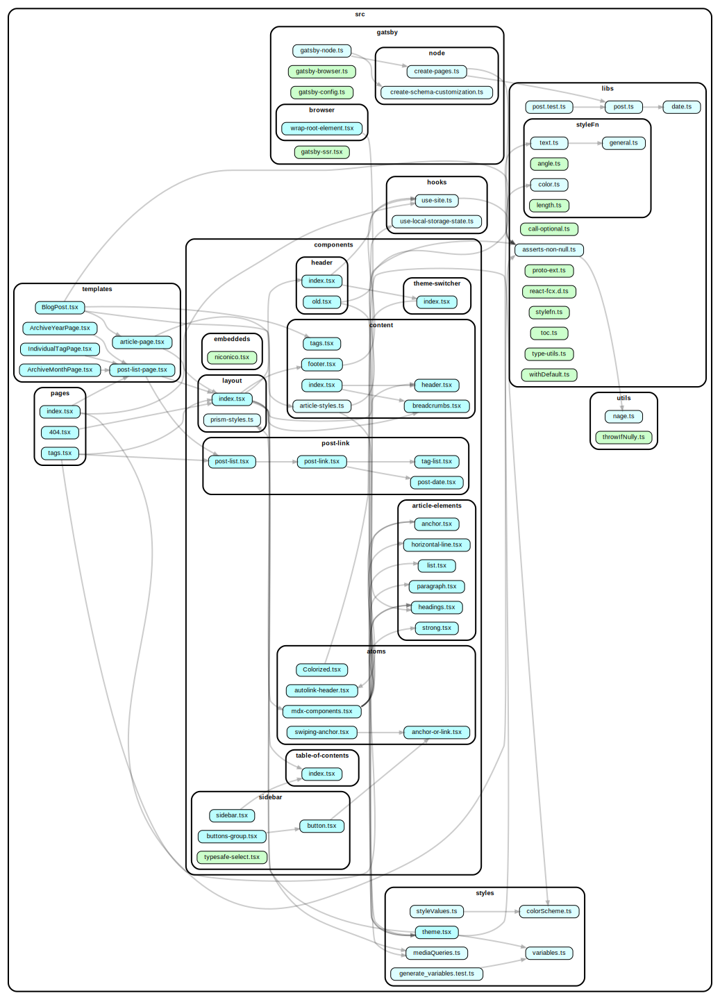

# blog.hppd.dev

Happy Paddy!!!!!

## 使ってるもの

言語は(ほぼ)100% TypeScript, フレームワークはGatsby, ブログの記事はMDX, スタイリングはEmotionとTailwind, デプロイは Firebase Hosting, その他はpackage.jsonを読んでね

### Gatsby プラグイン

- emotion
- google-analytics
- graphql-codegen
- manifest
- mdx
  - autolink-headers
  - code-titles
  - prismjs
- postcss
- react-helmet
- typescript
- source-filesystem

### その他特記事項

TailwindはPostCSSとEmotion(twin.macro)の2段構成。
gatsby-nodeをTypeScriptで書き、gatsby-node.jsでts-nodeを呼んでトランスパイルしている。

## ライセンス

MIT License

## うごかす

`git clone` して `npm i` して `npm start` して `localhost:8000` に接続！以上！！

## なんかこうファイル間の依存関係が見れるやつ

brewかaptかなんかで`graphviz`を導入して `npm run depgraph` で出てくる `dependencygraph.svg` を見ると幸せになれるぞ！

