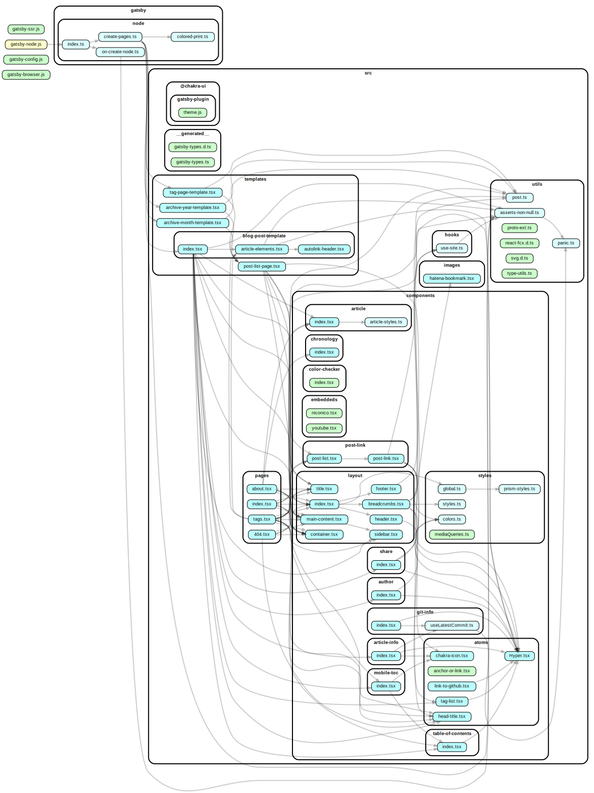

# blog.kkrn.me

こころのめー！！！のぶろぐー！！！

## 使ってるもの

言語は100% TypeScript, フレームワークはGatsby, ブログの記事はMDX, スタイリングはEmotion, アイコン類は Font Awesome, その他はpackage.jsonを読め

## ライセンス

MITライセンス

## うごかす

`git clone` して `npm i` して `npm start` して `localhost:8000` に接続！以上！！

## なんかこうファイル間の依存関係が見れるやつ

`graphviz`を導入して `npm run depgraph` で出てくる `dependencygraph.svg`

